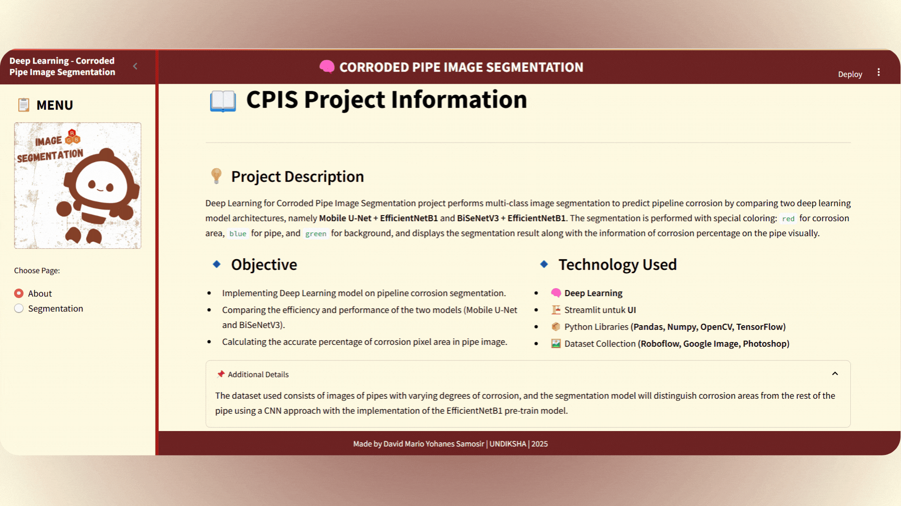

# 🔬 CPIS: Deep Learning-based Corroded Pipe Image Segmentation App

CPIS adalah aplikasi berbasis **Streamlit** untuk melakukan **segmentasi gambar korosi** menggunakan model deep learning. Aplikasi ini memungkinkan pengguna untuk memilih model, mengunggah gambar, melakukan segmentasi, serta mengevaluasi hasilnya dengan metrik seperti **IoU** dan **Dice Coefficient**.

🌐 **Coba Aplikasinya di Sini**: [https://dmys-msis-cp.streamlit.app/](https://dmys-msis-cp.streamlit.app/)




---

## 📌 Fitur Utama

- 🔍 **Segmentasi Gambar Korosi** secara interaktif.
- 🧠 Mendukung dua model deep learning: Mobile U-Net & BiSeNetV3.
- 📏 Opsi ukuran segmentasi gambar (128x128, 256x256).
- 🎨 Visualisasi hasil segmentasi dan overlay.
- 📊 Evaluasi performa model menggunakan mIoU & Dice.
- 📥 Antarmuka upload yang user-friendly.
- 🖼️ Dukungan multi-kelas korosi (3 kelas warna: merah, biru, hijau).

---

## 🚀 Instalasi

### 1. Clone Repository

```bash
git clone https://github.com/username/CPIS.git
cd CPIS
```

### 2. Buat Virtual Environment (Opsional tapi disarankan)

```bash
python -m venv venv
source venv/bin/activate  # Windows: venv\Scripts\activate
```

### 3. Install Dependencies

```bash
pip install -r requirements.txt
```

### 4. Jalankan Aplikasi

```bash
streamlit run app.py
```

---

## 🧠 Model Deep Learning

Aplikasi ini mendukung dua model pretrained untuk segmentasi korosi:

| Model           | Backbone         | Ukuran Input | Format    |
|----------------|------------------|--------------|-----------|
| Mobile U-Net   | EfficientNetB1   | 256, 256     | `.keras`  |
| BiSeNetV3      | EfficientNetB1   | 256, 256     | `.keras`  |

Model-model disimpan dalam folder `models/` dan dimuat sesuai pilihan user di aplikasi.

---

## 🖼️ Tampilan Menu

### 🔹 Menu: About
Menampilkan penjelasan tentang tujuan dan langkah penggunaan aplikasi.

### 🔹 Menu: Segmentasi
- Pilih model dan ukuran input
- Unggah gambar yang akan disegmentasi
- Lakukan segmentasi
- Tampilkan hasil segmentasi, overlay, dan informasi korosi (persentase + warna)

### 🔹 Menu: Metriks
- Unggah gambar asli dan Ground Truth
- Pilih model dan ukuran
- Evaluasi performa segmentasi dengan mIoU dan Dice Coefficient

---

## 🎨 Format Warna Segmentasi

| Kelas        | Warna Visualisasi |
|--------------|-------------------|
| 0 (Latar)    | Merah             |
| 1 (Korosi 1) | Biru              |
| 2 (Korosi 2) | Hijau             |

---

## 🧪 Contoh Gambar

- `data/sample/`: Folder berisi contoh gambar input dan ground truth yang bisa digunakan untuk uji coba.

---

## 📁 Struktur Proyek

```
CPIS/
│
├── models/                 # Model terlatih (.keras)
├── data/                   # Contoh gambar dan ground truth
├── app.py                  # File utama aplikasi Streamlit
├── utils/                  # Fungsi bantu seperti preprocessing, evaluasi
├── requirements.txt        # Daftar dependensi
└── README.md               # Dokumentasi proyek ini
```

---

## 👤 Tentang Pembuat

**Nama:** David Mario Yohanes Samosir  
**Jenis Proyek:** Tugas Akhir (SKRIPSI), 2025  

📧 Email: [davidmario484@gmail.com](mailto:davidmario484@gmail.com)  
📷 Instagram: [@dmys_6](https://instagram.com/dmys_6)  
💼 LinkedIn: [David Mario Yohanes Samosir](https://www.linkedin.com/in/david-mario-yohanes-samosir)

---

> Dibuat untuk mendukung deteksi dan analisis korosi berbasis AI.
